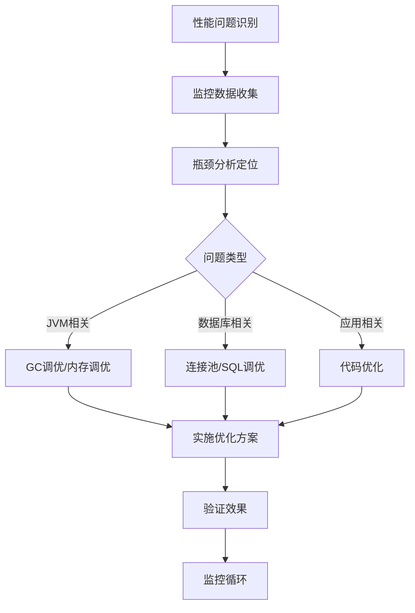

# 系统性能调优全攻略：JVM、数据库连接池与GC日志分析

## 目录
- [1. JVM性能调优](#1-jvm性能调优)
- [2. 数据库连接池调优](#2-数据库连接池调优)
- [3. GC日志分析与优化](#3-gc日志分析与优化)
- [4. 综合调优策略](#4-综合调优策略)

---

## 1. JVM性能调优

### 1.1 内存区域划分与配置

```bash
# 典型的生产环境JVM参数配置
java -Xms4g -Xmx4g \
     -Xmn2g \
     -XX:MetaspaceSize=256m \
     -XX:MaxMetaspaceSize=256m \
     -XX:SurvivorRatio=8 \
     -XX:+UseG1GC \
     -XX:MaxGCPauseMillis=200 \
     -XX:+PrintGCDetails \
     -XX:+PrintGCDateStamps \
     -Xloggc:/opt/logs/gc.log
```

### 1.2 关键参数详解

#### 堆内存配置
| 参数 | 说明 | 推荐值 |
|------|------|--------|
| -Xms | 初始堆大小 | 等于Xmx的50%-70% |
| -Xmx | 最大堆大小 | 物理内存的1/4到1/2 |
| -Xmn | 新生代大小 | Xmx的1/3到1/2 |
| -XX:NewRatio | 新生代/老年代比例 | 2-3 |
| -XX:SurvivorRatio | Eden/Survivor比例 | 8 |

#### 垃圾收集器选择
| 收集器 | 适用场景 | 参数 |
|--------|----------|------|
| Serial | 客户端应用、小内存 | -XX:+UseSerialGC |
| Parallel | 吞吐量优先 | -XX:+UseParallelGC |
| CMS | 低延迟、响应时间敏感 | -XX:+UseConcMarkSweepGC |
| G1 | 大堆内存、可预测停顿 | -XX:+UseG1GC |
| ZGC | 超大堆、极致低延迟 | -XX:+UseZGC |

### 1.3 调优实战步骤

```java
// 1. 监控JVM状态
public class JVMMonitor {
    public static void main(String[] args) {
        // 打印内存信息
        Runtime runtime = Runtime.getRuntime();
        long totalMemory = runtime.totalMemory();
        long freeMemory = runtime.freeMemory();
        long maxMemory = runtime.maxMemory();
        
        System.out.printf("总内存: %.2f MB%n", totalMemory / 1024.0 / 1024.0);
        System.out.printf("空闲内存: %.2f MB%n", freeMemory / 1024.0 / 1024.0);
        System.out.printf("最大内存: %.2f MB%n", maxMemory / 1024.0 / 1024.0);
    }
}
```

---

## 2. 数据库连接池调优

### 2.1 连接池核心参数

```yaml
# HikariCP 配置示例
spring:
  datasource:
    hikari:
      minimum-idle: 10
      maximum-pool-size: 50
      idle-timeout: 600000
      connection-timeout: 30000
      max-lifetime: 1800000
      connection-test-query: SELECT 1
      pool-name: MyHikariCP
      
# Druid 配置示例
spring:
  datasource:
    druid:
      initial-size: 5
      min-idle: 5
      max-active: 50
      max-wait: 60000
      time-between-eviction-runs-millis: 60000
      min-evictable-idle-time-millis: 300000
      validation-query: SELECT 1
      test-while-idle: true
      test-on-borrow: false
      test-on-return: false
```

### 2.2 参数调优原则

#### 容量规划公式
```python
# 理论最大连接数计算
max_connections = (core_count * 2) + effective_spindle_count

# 实际调优考虑因素：
# 1. 应用服务器CPU核心数
# 2. 数据库服务器能力
# 3. 平均查询执行时间
# 4. 并发用户数
# 5. 事务特性
```

#### 监控指标阈值
| 指标 | 健康范围 | 告警阈值 |
|------|----------|----------|
| 活跃连接数 | < 最大连接数的80% | > 最大连接数的90% |
| 空闲连接数 | 最小空闲连接数±20% | < 最小空闲连接数50% |
| 等待获取连接时间 | < 100ms | > 300ms |
| 连接创建时间 | < 1s | > 3s |

### 2.3 连接泄漏检测

```java
// 连接泄漏检测代码示例
public class ConnectionLeakDetector {
    private static final ThreadLocal<Long> startTime = new ThreadLocal<>();
    
    public static void start() {
        startTime.set(System.currentTimeMillis());
    }
    
    public static void end() {
        Long start = startTime.get();
        if (start != null) {
            long duration = System.currentTimeMillis() - start;
            if (duration > 30000) { // 超过30秒告警
                log.warn("潜在连接泄漏，耗时: {}ms", duration);
            }
            startTime.remove();
        }
    }
}

// 使用AOP监控连接使用
@Aspect
@Component
public class ConnectionMonitorAspect {
    @Around("execution(* javax.sql.DataSource.getConnection(..))")
    public Object monitorConnection(ProceedingJoinPoint joinPoint) throws Throwable {
        ConnectionLeakDetector.start();
        try {
            return joinPoint.proceed();
        } finally {
            ConnectionLeakDetector.end();
        }
    }
}
```

---

## 3. GC日志分析与优化

### 3.1 GC日志配置与解析

```bash
# 完整的GC日志配置
-XX:+PrintGCDetails 
-XX:+PrintGCDateStamps 
-XX:+PrintGCTimeStamps 
-XX:+PrintTenuringDistribution 
-XX:+PrintGCApplicationStoppedTime 
-XX:+PrintGCApplicationConcurrentTime 
-XX:+PrintReferenceGC 
-Xloggc:/path/to/gc.log 
-XX:+UseGCLogFileRotation 
-XX:NumberOfGCLogFiles=10 
-XX:GCLogFileSize=100M
```

### 3.2 GC日志分析工具

| 工具名称 | 特点 | 适用场景 |
|----------|------|----------|
| GCViewer | 图形化分析 | 离线分析、趋势观察 |
| gceasy.io | 在线分析 | 快速诊断、报告生成 |
| IBM GCMV | IBM官方工具 | IBM JDK深度分析 |
| HPjmeter | 企业级分析 | 性能基准测试 |

### 3.3 常见GC问题及解决方案

#### 问题1：频繁Full GC
```log
# 典型日志模式
2024-01-15T10:30:25.123+0800: [Full GC (Allocation Failure) 
  [PSYoungGen: 1024K->0K(1536K)] 
  [ParOldGen: 4096K->4096K(8192K)] 
  5120K->4096K(9728K), 
  [Metaspace: 256K->256K(4480K)], 
  0.1234567 secs]
```

**解决方案：**
1. 增加堆内存：`-Xmx4g -Xms4g`
2. 调整新生代比例：`-XX:NewRatio=2`
3. 优化对象生命周期

#### 问题2：长时间GC暂停
```log
# 长暂停日志
[Times: user=1.23 sys=0.45, real=0.98 secs]
```

**解决方案：**
1. 切换到低延迟收集器：`-XX:+UseG1GC`
2. 设置最大停顿时间：`-XX:MaxGCPauseMillis=200`
3. 调整Region大小：`-XX:G1HeapRegionSize=4M`

#### 问题3：内存泄漏
```java
// 内存泄漏检测方法
public class MemoryLeakDetector {
    public static void dumpHeapOnFullGC() {
        // 配置当Full GC时dump堆内存
        -XX:+HeapDumpOnOutOfMemoryError
        -XX:HeapDumpPath=/path/to/dumps
        -XX:+HeapDumpBeforeFullGC
        -XX:+HeapDumpAfterFullGC
    }
    
    // 使用jmap手动dump
    // jmap -dump:live,format=b,file=heap.bin <pid>
}
```

### 3.4 G1 GC专项调优

```bash
# G1 GC优化配置示例
-XX:+UseG1GC
-XX:MaxGCPauseMillis=200
-XX:G1HeapRegionSize=4m
-XX:InitiatingHeapOccupancyPercent=45
-XX:G1ReservePercent=10
-XX:G1HeapWastePercent=5
-XX:G1MixedGCCountTarget=8
-XX:G1MixedGCLiveThresholdPercent=85
```

#### G1调优检查表
| 参数 | 默认值 | 调优建议 |
|------|--------|----------|
| MaxGCPauseMillis | 200ms | 根据SLA调整 |
| InitiatingHeapOccupancyPercent | 45% | 监控后调整 |
| G1HeapRegionSize | 自动计算 | 1-32M之间 |
| G1NewSizePercent | 5% | 根据Young GC频率调整 |
| G1MaxNewSizePercent | 60% | 根据Young GC频率调整 |

---

## 4. 综合调优策略

### 4.1 性能调优方法论



### 4.2 监控指标体系

#### JVM监控指标
```bash
# 使用jstat监控
jstat -gcutil <pid> 1000 10
jstat -gccapacity <pid> 1000 10
jstat -gcnew <pid> 1000 10

# 关键指标说明
S0/S1: Survivor区使用率
E: Eden区使用率
O: 老年代使用率
M: 元空间使用率
YGC/YGCT: Young GC次数/时间
FGC/FGCT: Full GC次数/时间
```

#### 连接池监控指标
```java
// HikariCP监控
HikariDataSource dataSource = (HikariDataSource) context.getBean("dataSource");
HikariPoolMXBean poolMXBean = dataSource.getHikariPoolMXBean();

System.out.println("活跃连接: " + poolMXBean.getActiveConnections());
System.out.println("空闲连接: " + poolMXBean.getIdleConnections());
System.out.println("等待连接数: " + poolMXBean.getThreadsAwaitingConnection());
System.out.println("总连接数: " + poolMXBean.getTotalConnections());
```

### 4.3 最佳实践总结

#### 调优原则
1. **测量优先**：永远基于数据做决策
2. **渐进调优**：一次只改变一个参数
3. **回归测试**：每次调优后验证效果
4. **文档记录**：记录所有调优变更

#### 避坑指南
1. ❌ 不要盲目设置`-Xmx`为物理内存的80%
2. ❌ 不要禁用所有GC日志以"提升性能"
3. ❌ 不要在生产环境使用`-XX:+AggressiveOpts`
4. ❌ 不要设置`-XX:NewRatio=1`（除非有充分理由）

#### 自动化调优脚本示例
```bash
#!/bin/bash
# auto_tune_jvm.sh

APP_PID=$1
TUNE_LOG="/var/log/jvm_tune_$(date +%Y%m%d).log"

# 收集基础信息
echo "=== JVM调优分析报告 $(date) ===" > $TUNE_LOG
echo "PID: $APP_PID" >> $TUNE_LOG

# 分析GC日志
analyze_gc() {
    local gc_log=$1
    echo -e "\n--- GC分析 ---" >> $TUNE_LOG
    
    # 统计Full GC次数
    local full_gc_count=$(grep -c "Full GC" $gc_log)
    echo "Full GC次数: $full_gc_count" >> $TUNE_LOG
    
    # 计算平均暂停时间
    local avg_pause=$(awk '/real=/ {sum+=$NF; count++} END {print sum/count}' $gc_log)
    echo "平均GC暂停时间: ${avg_pause}ms" >> $TUNE_LOG
}

# 生成调优建议
generate_recommendation() {
    echo -e "\n--- 调优建议 ---" >> $TUNE_LOG
    
    if [ $full_gc_count -gt 10 ]; then
        echo "建议：增加堆内存或调整新生代大小" >> $TUNE_LOG
    fi
    
    if [ $(echo "$avg_pause > 200" | bc) -eq 1 ]; then
        echo "建议：考虑使用G1 GC或调整暂停时间目标" >> $TUNE_LOG
    fi
}

# 执行分析
analyze_gc "/path/to/gc.log"
generate_recommendation

echo "分析完成，报告保存在: $TUNE_LOG"
```

### 4.4 持续优化体系

| 优化阶段 | 目标 | 工具 |
|----------|------|------|
| 开发期 | 预防性能问题 | SonarQube, SpotBugs |
| 测试期 | 发现性能瓶颈 | JMeter, Gatling |
| 预发期 | 验证调优效果 | Arthas, JProfiler |
| 生产期 | 监控与告警 | Prometheus, Grafana |
| 复盘期 | 优化总结 | ELK, 监控报表 |

---

## 附录：常用命令速查

### JVM相关
```bash
# 查看JVM参数
jinfo -flags <pid>

# 堆内存dump
jmap -dump:live,format=b,file=heap.bin <pid>

# 线程dump
jstack <pid> > thread.dump

# 监控类加载
jstat -class <pid> 1000 10
```

### 数据库连接池
```sql
-- 查看数据库连接
-- MySQL
SHOW PROCESSLIST;
SHOW STATUS LIKE 'Threads_connected';

-- PostgreSQL
SELECT * FROM pg_stat_activity;

-- Oracle
SELECT * FROM v$session;
```