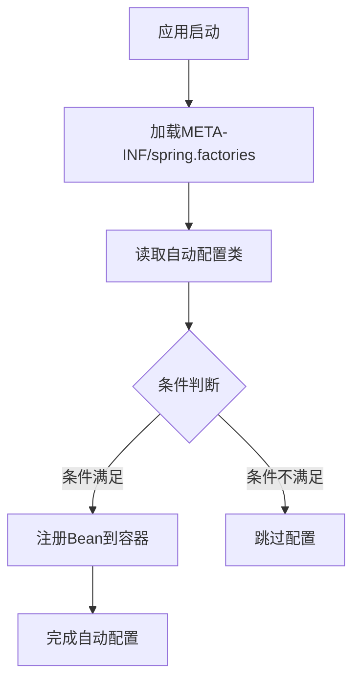

# Spring Boot 核心技术深度解析

## 一、自动配置（Auto-Configuration）

### 1.1 自动配置的核心原理

Spring Boot自动配置基于条件化配置实现，核心是`@Conditional`注解及其衍生注解。

```java
// 自动配置的核心注解
@Configuration
@ConditionalOnClass({ DataSource.class, EmbeddedDatabaseType.class })
@AutoConfigureOrder(Ordered.HIGHEST_PRECEDENCE)
@EnableConfigurationProperties(DataSourceProperties.class)
public class DataSourceAutoConfiguration {
    
    @Configuration
    @ConditionalOnMissingBean(DataSource.class)
    @ConditionalOnProperty(prefix = "spring.datasource", name = "type", havingValue = "com.zaxxer.hikari.HikariDataSource", matchIfMissing = true)
    public static class Hikari {
        
        @Bean
        @ConfigurationProperties(prefix = "spring.datasource.hikari")
        public HikariDataSource dataSource(DataSourceProperties properties) {
            HikariDataSource dataSource = createDataSource(properties, HikariDataSource.class);
            // 配置优化
            return dataSource;
        }
    }
}
```

### 1.2 条件注解详解

| 注解 | 说明 |
|------|------|
| `@ConditionalOnClass` | 类路径下存在指定类时生效 |
| `@ConditionalOnMissingBean` | 容器中不存在指定Bean时生效 |
| `@ConditionalOnProperty` | 配置文件中存在指定属性时生效 |
| `@ConditionalOnWebApplication` | 当前是Web应用时生效 |
| `@ConditionalOnExpression` | SpEL表达式为true时生效 |
| `@ConditionalOnJava` | 指定Java版本时生效 |
| `@ConditionalOnResource` | 存在指定资源文件时生效 |

### 1.3 自动配置的执行流程



### 1.4 自动配置的调试技巧

```properties
# 启用自动配置报告
debug=true

# 排除特定自动配置类
spring.autoconfigure.exclude=org.springframework.boot.autoconfigure.security.servlet.SecurityAutoConfiguration
```

## 二、Starter开发指南

### 2.1 Starter的设计原则

**约定优于配置**：Starter应该提供合理的默认配置，同时允许用户自定义。

**模块化设计**：每个Starter应该只解决一个特定的问题。

**依赖管理**：处理好传递依赖，避免版本冲突。

### 2.2 自定义Starter步骤

#### 步骤1：创建项目结构
```
my-spring-boot-starter/
├── my-spring-boot-autoconfigure/
│   ├── src/main/java/
│   │   └── com/example/
│   │       ├── MyService.java
│   │       ├── MyProperties.java
│   │       └── MyAutoConfiguration.java
│   └── src/main/resources/
│       └── META-INF/
│           └── spring.factories
└── my-spring-boot-starter/
    └── pom.xml
```

#### 步骤2：定义配置属性类
```java
@ConfigurationProperties(prefix = "my.service")
public class MyProperties {
    
    private String endpoint = "http://default.endpoint";
    private int timeout = 5000;
    private boolean enabled = true;
    
    // Getter和Setter方法
    // 验证注解
    @NotNull
    private String apiKey;
    
    @Min(1000)
    @Max(60000)
    private int connectionTimeout;
}
```

#### 步骤3：创建自动配置类
```java
@Configuration
@EnableConfigurationProperties(MyProperties.class)
@ConditionalOnClass(MyService.class)
@ConditionalOnProperty(prefix = "my.service", name = "enabled", havingValue = "true", matchIfMissing = true)
@AutoConfigureAfter(DataSourceAutoConfiguration.class)
public class MyAutoConfiguration {
    
    private final MyProperties properties;
    
    public MyAutoConfiguration(MyProperties properties) {
        this.properties = properties;
    }
    
    @Bean
    @ConditionalOnMissingBean
    public MyService myService() {
        return new MyService(properties.getEndpoint(), properties.getTimeout());
    }
    
    @Bean
    public MyServiceHelper myServiceHelper(MyService myService) {
        return new MyServiceHelper(myService);
    }
}
```

#### 步骤4：注册自动配置
```properties
# src/main/resources/META-INF/spring.factories
org.springframework.boot.autoconfigure.EnableAutoConfiguration=\
  com.example.MyAutoConfiguration
```

#### 步骤5：创建Starter模块的pom.xml
```xml
<?xml version="1.0" encoding="UTF-8"?>
<project xmlns="http://maven.apache.org/POM/4.0.0">
    <modelVersion>4.0.0</modelVersion>
    
    <artifactId>my-spring-boot-starter</artifactId>
    <packaging>jar</packaging>
    
    <dependencies>
        <dependency>
            <groupId>com.example</groupId>
            <artifactId>my-spring-boot-autoconfigure</artifactId>
            <version>${project.version}</version>
        </dependency>
        <!-- 其他必要的依赖 -->
    </dependencies>
</project>
```

### 2.3 高级Starter特性

#### 条件化Bean注册
```java
@Configuration
public class ConditionalConfiguration {
    
    @Bean
    @ConditionalOnCloudPlatform(CloudPlatform.CLOUD_FOUNDRY)
    public CloudService cloudService() {
        return new CloudFoundryService();
    }
    
    @Bean
    @ConditionalOnMissingClass("org.springframework.cloud.CloudPlatform")
    public LocalService localService() {
        return new LocalService();
    }
}
```

#### 配置元数据生成
```java
// 生成配置元数据，用于IDE提示
@ConfigurationProperties(prefix = "my.service")
@ConstructorBinding
public class MyProperties {
    
    /**
     * 服务端点地址
     */
    private final String endpoint;
    
    /**
     * 连接超时时间(ms)
     */
    private final int timeout;
}
```

## 三、Actuator监控体系

### 3.1 Actuator核心端点

#### 3.1.1 健康检查端点
```yaml
# 配置健康检查详情
management:
  endpoint:
    health:
      show-details: always
      show-components: always
  health:
    # 自定义健康指标
    redis:
      enabled: true
    db:
      enabled: true
    disk:
      enabled: true
```

自定义健康指示器：
```java
@Component
public class CustomHealthIndicator implements HealthIndicator {
    
    private final MyService myService;
    
    public CustomHealthIndicator(MyService myService) {
        this.myService = myService;
    }
    
    @Override
    public Health health() {
        try {
            boolean isHealthy = myService.check();
            if (isHealthy) {
                return Health.up()
                    .withDetail("responseTime", myService.getResponseTime())
                    .withDetail("version", "1.0.0")
                    .build();
            } else {
                return Health.down()
                    .withDetail("error", "Service unavailable")
                    .withException(new ServiceException("Service down"))
                    .build();
            }
        } catch (Exception e) {
            return Health.down(e).build();
        }
    }
}
```

#### 3.1.2 指标端点
```java
@Component
public class CustomMetrics {
    
    private final MeterRegistry meterRegistry;
    private final Counter requestCounter;
    private final Timer processingTimer;
    private final DistributionSummary payloadSize;
    
    public CustomMetrics(MeterRegistry meterRegistry) {
        this.meterRegistry = meterRegistry;
        
        // 创建自定义指标
        this.requestCounter = Counter.builder("myapp.requests.total")
            .description("Total number of requests")
            .tag("application", "my-service")
            .register(meterRegistry);
            
        this.processingTimer = Timer.builder("myapp.processing.time")
            .description("Request processing time")
            .publishPercentiles(0.5, 0.95, 0.99)
            .register(meterRegistry);
            
        this.payloadSize = DistributionSummary.builder("myapp.payload.size")
            .baseUnit("bytes")
            .description("Payload size distribution")
            .register(meterRegistry);
    }
    
    public void recordRequest() {
        requestCounter.increment();
    }
    
    public void recordProcessingTime(Runnable task) {
        processingTimer.record(task);
    }
}
```

### 3.2 自定义端点

```java
@Component
@Endpoint(id = "features")
public class FeaturesEndpoint {
    
    private final List<Feature> features;
    
    // 读取操作
    @ReadOperation
    public List<Feature> features() {
        return features;
    }
    
    // 写操作
    @WriteOperation
    public void enableFeature(@Selector String name) {
        features.stream()
            .filter(f -> f.getName().equals(name))
            .findFirst()
            .ifPresent(Feature::enable);
    }
    
    // 删除操作
    @DeleteOperation
    public void disableFeature(@Selector String name) {
        features.stream()
            .filter(f -> f.getName().equals(name))
            .findFirst()
            .ifPresent(Feature::disable);
    }
}

// 启用JMX端点
@Configuration
@EndpointWebExtension(endpoint = FeaturesEndpoint.class)
public class FeaturesEndpointWebExtension {
    
    private final FeaturesEndpoint delegate;
    
    public FeaturesEndpointWebExtension(FeaturesEndpoint delegate) {
        this.delegate = delegate;
    }
    
    @ReadOperation
    public WebEndpointResponse<List<Feature>> features() {
        List<Feature> features = delegate.features();
        return new WebEndpointResponse<>(features, 200);
    }
}
```

### 3.3 监控数据导出

#### 3.3.1 Prometheus配置
```yaml
management:
  endpoints:
    web:
      exposure:
        include: health,metrics,prometheus
  metrics:
    export:
      prometheus:
        enabled: true
        step: 1m
        descriptions: true
    tags:
      application: ${spring.application.name}
      instance: ${spring.cloud.client.ip-address}:${server.port}
```

#### 3.3.2 Micrometer配置
```java
@Configuration
public class MetricsConfig {
    
    @Bean
    public MeterRegistryCustomizer<MeterRegistry> metricsCommonTags() {
        return registry -> registry.config()
            .commonTags("application", "myapp")
            .commonTags("region", System.getenv("REGION"))
            .meterFilter(new MeterFilter() {
                @Override
                public DistributionStatisticConfig configure(Meter.Id id, 
                                                           DistributionStatisticConfig config) {
                    if (id.getName().startsWith("http.server.requests")) {
                        return DistributionStatisticConfig.builder()
                            .percentiles(0.5, 0.75, 0.95, 0.99)
                            .build()
                            .merge(config);
                    }
                    return config;
                }
            });
    }
    
    @Bean
    public TimedAspect timedAspect(MeterRegistry registry) {
        return new TimedAspect(registry);
    }
}
```

### 3.4 高级监控特性

#### 3.4.1 分布式追踪
```java
@Configuration
public class TracingConfig {
    
    @Bean
    public Tracer tracer() {
        return Tracing.newBuilder()
            .localServiceName("my-service")
            .spanReporter(new LoggingReporter())
            .sampler(Sampler.create(0.1f)) // 采样率10%
            .build()
            .tracer();
    }
    
    @Bean
    public Filter tracingFilter(Tracer tracer) {
        return TracingFilter.create(tracer);
    }
}
```

#### 3.4.2 性能监控
```java
@Aspect
@Component
@Slf4j
public class PerformanceMonitorAspect {
    
    private final MeterRegistry meterRegistry;
    
    public PerformanceMonitorAspect(MeterRegistry meterRegistry) {
        this.meterRegistry = meterRegistry;
    }
    
    @Around("@annotation(MonitorPerformance)")
    public Object monitorPerformance(ProceedingJoinPoint joinPoint) throws Throwable {
        String methodName = joinPoint.getSignature().getName();
        Timer.Sample sample = Timer.start(meterRegistry);
        
        try {
            return joinPoint.proceed();
        } finally {
            sample.stop(Timer.builder("method.execution.time")
                .tag("method", methodName)
                .tag("class", joinPoint.getTarget().getClass().getSimpleName())
                .register(meterRegistry));
        }
    }
}
```

## 四、最佳实践与优化

### 4.1 自动配置优化建议

1. **延迟初始化**：使用`@Lazy`注解减少启动时间
2. **条件化导入**：使用`@ConditionalOnClass`避免类加载异常
3. **配置顺序**：使用`@AutoConfigureBefore`、`@AutoConfigureAfter`控制配置顺序
4. **避免循环依赖**：仔细设计Bean之间的依赖关系

### 4.2 Starter开发最佳实践

1. **版本管理**：使用BOM管理依赖版本
2. **向后兼容**：保持API的稳定性
3. **文档完善**：提供完整的配置示例
4. **测试覆盖**：编写集成测试确保功能正常

### 4.3 监控系统设计原则

1. **最小侵入**：监控不应该影响业务逻辑
2. **可观察性**：提供日志、指标、追踪三位一体的监控
3. **预警机制**：设置合理的阈值和告警规则
4. **可视化展示**：使用Grafana等工具展示监控数据

## 五、实战案例

### 5.1 数据库连接池Starter
```java
@Configuration
@ConditionalOnClass(DataSource.class)
@EnableConfigurationProperties(DatabaseProperties.class)
public class DatabaseAutoConfiguration {
    
    @Bean
    @ConditionalOnMissingBean
    @ConditionalOnProperty(prefix = "database", name = "type", havingValue = "hikari")
    public DataSource hikariDataSource(DatabaseProperties properties) {
        HikariConfig config = new HikariConfig();
        config.setJdbcUrl(properties.getUrl());
        config.setUsername(properties.getUsername());
        config.setPassword(properties.getPassword());
        config.setMaximumPoolSize(properties.getMaxPoolSize());
        config.setMinimumIdle(properties.getMinIdle());
        config.setConnectionTimeout(properties.getConnectionTimeout());
        return new HikariDataSource(config);
    }
    
    @Bean
    public DatabaseHealthIndicator databaseHealthIndicator(DataSource dataSource) {
        return new DatabaseHealthIndicator(dataSource);
    }
}
```

### 5.2 业务指标监控
```java
@Component
public class BusinessMetrics {
    
    private final Counter orderCounter;
    private final Gauge inventoryGauge;
    private final Timer paymentTimer;
    
    public BusinessMetrics(MeterRegistry registry, InventoryService inventoryService) {
        this.orderCounter = Counter.builder("business.orders.total")
            .description("Total number of orders")
            .register(registry);
            
        this.inventoryGauge = Gauge.builder("business.inventory.level", 
                () -> inventoryService.getStockLevel())
            .description("Current inventory level")
            .register(registry);
            
        this.paymentTimer = Timer.builder("business.payment.processing.time")
            .description("Payment processing time")
            .publishPercentileHistogram()
            .register(registry);
    }
}
```