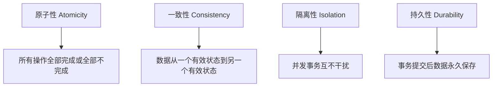
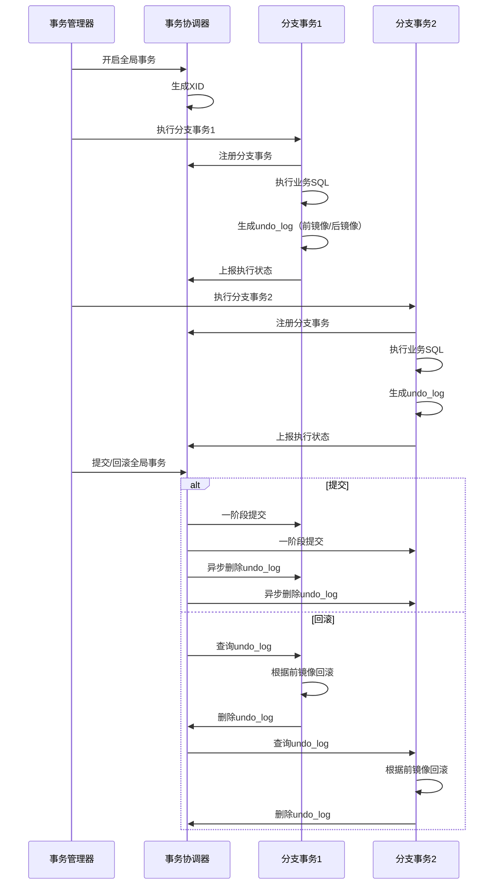
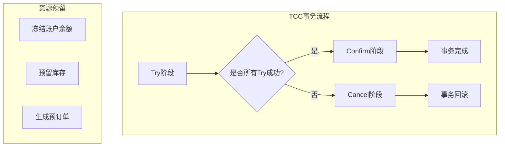
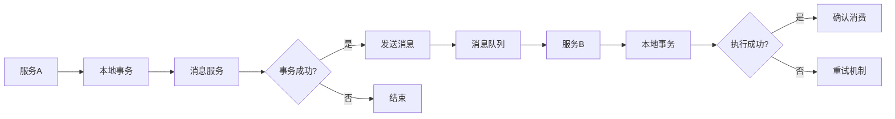
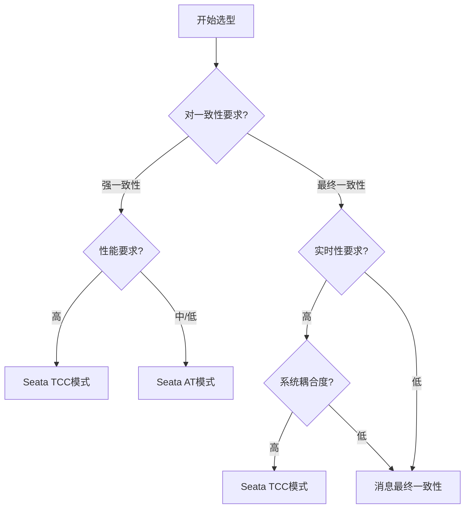

# 分布式事务解决方案详解

## 一、分布式事务的挑战与核心问题

### 1.1 为什么需要分布式事务？
随着微服务架构的普及，单个业务操作往往需要跨多个服务、多个数据库，这就产生了分布式事务的需求。传统的单体应用事务（ACID）在分布式环境下无法直接应用。

### 1.2 CAP理论与BASE理论
- **CAP定理**：一致性(Consistency)、可用性(Availability)、分区容错性(Partition Tolerance)三者不可兼得
- **BASE理论**：
  - Basically Available（基本可用）
  - Soft state（软状态）
  - Eventually consistent（最终一致性）

### 1.3 分布式事务核心问题


## 二、Seata AT模式（自动补偿型）

### 2.1 架构概览
```
┌─────────┐     ┌─────────┐     ┌─────────┐
│   TM    │────▶│   TC    │◀────│   RM    │
│(事务管理器)│     │(事务协调器)│     │(资源管理器)│
└─────────┘     └─────────┘     └─────────┘
     │                │                │
     ▼                ▼                ▼
 Begin TX       全局事务ID      分支事务注册
```

### 2.2 核心实现原理

#### 2.2.1 执行流程
```java
// 1. 开启全局事务
@GlobalTransactional
public void purchase() {
    // 2. 业务逻辑
    orderService.create();
    storageService.deduct();
    accountService.debit();
}
```

#### 2.2.2 两阶段提交机制


### 2.3 关键机制详解

#### 2.3.1 全局锁机制
```sql
-- Seata全局锁表
CREATE TABLE `global_table` (
    `xid` VARCHAR(128) NOT NULL,
    `transaction_id` BIGINT,
    `status` TINYINT NOT NULL,
    PRIMARY KEY (`xid`)
);

-- 分支锁表
CREATE TABLE `branch_table` (
    `branch_id` BIGINT NOT NULL,
    `xid` VARCHAR(128) NOT NULL,
    `table_name` VARCHAR(64),
    `pk` VARCHAR(36),
    PRIMARY KEY (`branch_id`)
);
```

#### 2.3.2 Undo Log设计
```json
{
  "beforeImage": {
    "tableName": "account",
    "rows": [{
      "fields": [{
        "name": "id",
        "type": 4,
        "value": 1
      }, {
        "name": "balance",
        "type": 3,
        "value": 1000
      }]
    }]
  },
  "afterImage": {
    "tableName": "account",
    "rows": [{
      "fields": [{
        "name": "id",
        "type": 4,
        "value": 1
      }, {
        "name": "balance",
        "type": 3,
        "value": 900
      }]
    }]
  }
}
```

### 2.4 优缺点分析

**优点：**
- 对业务代码侵入性低
- 自动生成回滚日志
- 支持大部分SQL操作

**缺点：**
- 需要额外的锁表，存在性能损耗
- 不支持所有数据库类型
- 全局锁可能导致死锁

## 三、Seata TCC模式（补偿型）

### 3.1 TCC核心概念
TCC（Try-Confirm-Cancel）是一种基于补偿的事务模式：
- **Try**：尝试执行业务，完成所有业务检查，预留业务资源
- **Confirm**：确认执行业务，真正提交，要求Try成功才能执行
- **Cancel**：取消执行业务，释放Try阶段预留的资源

### 3.2 架构设计


### 3.3 代码实现示例

#### 3.3.1 TCC接口定义
```java
// 账户服务TCC接口
public interface AccountTccService {
    
    @TwoPhaseBusinessAction(
        name = "prepareDebit", 
        commitMethod = "commitDebit", 
        rollbackMethod = "cancelDebit"
    )
    boolean prepareDebit(BusinessActionContext context,
                        @BusinessActionContextParameter(paramName = "userId") String userId,
                        @BusinessActionContextParameter(paramName = "amount") BigDecimal amount);
    
    boolean commitDebit(BusinessActionContext context);
    
    boolean cancelDebit(BusinessActionContext context);
}

// 库存服务TCC接口
public interface InventoryTccService {
    
    @TwoPhaseBusinessAction(
        name = "prepareDeduct",
        commitMethod = "confirmDeduct",
        rollbackMethod = "cancelDeduct"
    )
    boolean prepareDeduct(BusinessActionContext context,
                         @BusinessActionContextParameter(paramName = "productId") String productId,
                         @BusinessActionContextParameter(paramName = "count") Integer count);
    
    boolean confirmDeduct(BusinessActionContext context);
    
    boolean cancelDeduct(BusinessActionContext context);
}
```

#### 3.3.2 具体实现
```java
@Service
public class AccountTccServiceImpl implements AccountTccService {
    
    @Autowired
    private AccountMapper accountMapper;
    
    @Autowired
    private AccountFreezeMapper freezeMapper;
    
    @Override
    @Transactional
    public boolean prepareDebit(BusinessActionContext context, 
                               String userId, BigDecimal amount) {
        // 1. 检查账户余额
        Account account = accountMapper.selectByUserId(userId);
        if (account.getBalance().compareTo(amount) < 0) {
            throw new RuntimeException("余额不足");
        }
        
        // 2. 冻结部分余额
        accountMapper.freezeBalance(userId, amount);
        
        // 3. 记录冻结记录
        AccountFreeze freeze = new AccountFreeze();
        freeze.setXid(context.getXid());
        freeze.setUserId(userId);
        freeze.setFreezeAmount(amount);
        freeze.setState(AccountFreezeState.TRY);
        freezeMapper.insert(freeze);
        
        return true;
    }
    
    @Override
    @Transactional
    public boolean commitDebit(BusinessActionContext context) {
        // 1. 获取冻结记录
        AccountFreeze freeze = freezeMapper.selectByXid(context.getXid());
        
        // 2. 扣减余额
        accountMapper.reduceBalance(freeze.getUserId(), freeze.getFreezeAmount());
        
        // 3. 删除冻结记录
        freezeMapper.deleteByXid(context.getXid());
        
        return true;
    }
    
    @Override
    @Transactional
    public boolean cancelDebit(BusinessActionContext context) {
        // 1. 获取冻结记录
        AccountFreeze freeze = freezeMapper.selectByXid(context.getXid());
        
        // 2. 解冻余额
        accountMapper.unfreezeBalance(freeze.getUserId(), freeze.getFreezeAmount());
        
        // 3. 删除冻结记录
        freezeMapper.deleteByXid(context.getXid());
        
        return true;
    }
}
```

### 3.4 异常处理与幂等性

#### 3.4.1 防悬挂控制
```java
@Component
public class TccActionInterceptor {
    
    public void preHandle(String xid, String actionName) {
        // 检查是否存在已完成的记录
        if (isCompleted(xid, actionName)) {
            throw new TccDuplicateRequestException("重复请求");
        }
        
        // 检查是否超时
        if (isTimeout(xid)) {
            throw new TccTimeoutException("事务已超时");
        }
    }
}
```

#### 3.4.2 幂等性保证
```java
public class IdempotentUtils {
    
    private static final ConcurrentHashMap<String, AtomicInteger> REQUEST_CACHE = 
        new ConcurrentHashMap<>();
    
    public static boolean checkAndSet(String key) {
        AtomicInteger counter = REQUEST_CACHE.computeIfAbsent(
            key, k -> new AtomicInteger(0)
        );
        
        return counter.incrementAndGet() == 1;
    }
    
    public static void remove(String key) {
        REQUEST_CACHE.remove(key);
    }
}
```

### 3.5 TCC优缺点分析

**优点：**
- 高性能，无全局锁
- 业务灵活度高
- 支持多种异构系统

**缺点：**
- 代码侵入性强
- 需要业务实现Try/Confirm/Cancel
- 网络调用增多

## 四、消息最终一致性

### 4.1 核心原理
基于消息队列的最终一致性方案，通过可靠消息传递确保数据最终一致。

### 4.2 典型架构


### 4.3 实现方案对比

| 方案 | 可靠性 | 复杂性 | 适用场景 |
|------|--------|--------|----------|
| 本地消息表 | 高 | 中 | 大部分业务场景 |
| RocketMQ事务消息 | 高 | 低 | 使用RocketMQ的场景 |
| 最大努力通知 | 中 | 低 | 对一致性要求不高的场景 |

### 4.4 本地消息表实现

#### 4.4.1 数据库设计
```sql
-- 本地消息表
CREATE TABLE `local_transaction_log` (
    `id` BIGINT PRIMARY KEY AUTO_INCREMENT,
    `business_key` VARCHAR(64) NOT NULL COMMENT '业务唯一标识',
    `message_content` TEXT NOT NULL COMMENT '消息内容',
    `status` TINYINT NOT NULL COMMENT '状态：0-待发送，1-已发送，2-已完成',
    `retry_count` INT DEFAULT 0 COMMENT '重试次数',
    `next_retry_time` DATETIME COMMENT '下次重试时间',
    `created_time` DATETIME NOT NULL,
    `updated_time` DATETIME NOT NULL,
    INDEX idx_status_retry (`status`, `next_retry_time`)
);

-- 消息消费记录表
CREATE TABLE `message_consume_log` (
    `id` BIGINT PRIMARY KEY AUTO_INCREMENT,
    `message_id` VARCHAR(64) NOT NULL COMMENT '消息ID',
    `consumer_group` VARCHAR(64) NOT NULL COMMENT '消费组',
    `status` TINYINT NOT NULL COMMENT '消费状态',
    `consume_time` DATETIME NOT NULL,
    UNIQUE KEY uk_message_consumer (`message_id`, `consumer_group`)
);
```

#### 4.4.2 事务消息服务
```java
@Service
@Slf4j
public class TransactionMessageService {
    
    @Autowired
    private LocalTransactionLogMapper logMapper;
    
    @Autowired
    private RabbitTemplate rabbitTemplate;
    
    @Transactional
    public boolean saveAndSendMessage(String businessKey, 
                                     String messageContent,
                                     String exchange,
                                     String routingKey) {
        // 1. 保存本地事务日志
        LocalTransactionLog log = new LocalTransactionLog();
        log.setBusinessKey(businessKey);
        log.setMessageContent(messageContent);
        log.setStatus(TransactionStatus.PENDING);
        log.setCreatedTime(new Date());
        log.setUpdatedTime(new Date());
        logMapper.insert(log);
        
        try {
            // 2. 发送消息到MQ
            Message message = MessageBuilder
                .withBody(messageContent.getBytes())
                .setHeader("transaction_id", log.getId())
                .build();
            
            rabbitTemplate.convertAndSend(exchange, routingKey, message);
            
            // 3. 更新状态为已发送
            log.setStatus(TransactionStatus.SENT);
            logMapper.updateById(log);
            
            return true;
        } catch (Exception e) {
            log.error("发送消息失败", e);
            throw new RuntimeException("消息发送失败", e);
        }
    }
    
    @Scheduled(fixedDelay = 10000)
    public void retryFailedMessages() {
        // 查询需要重试的消息
        List<LocalTransactionLog> failedMessages = logMapper
            .selectNeedRetryMessages(new Date());
        
        for (LocalTransactionLog message : failedMessages) {
            if (message.getRetryCount() >= MAX_RETRY_COUNT) {
                // 超过最大重试次数，标记为失败
                message.setStatus(TransactionStatus.FAILED);
                logMapper.updateById(message);
                continue;
            }
            
            try {
                // 重新发送消息
                retrySendMessage(message);
                message.setStatus(TransactionStatus.SENT);
            } catch (Exception e) {
                message.setRetryCount(message.getRetryCount() + 1);
                message.setNextRetryTime(calculateNextRetryTime(
                    message.getRetryCount()
                ));
            }
            
            logMapper.updateById(message);
        }
    }
}
```

### 4.5 消费者幂等性设计

```java
@Component
@Slf4j
public class OrderMessageConsumer {
    
    @Autowired
    private MessageConsumeLogMapper consumeLogMapper;
    
    @RabbitListener(queues = "order.create.queue")
    @Transactional
    public void handleOrderCreate(Message message, Channel channel) {
        String messageId = message.getMessageProperties().getMessageId();
        String consumerGroup = "order-service";
        
        // 1. 检查是否已消费
        if (consumeLogMapper.isConsumed(messageId, consumerGroup)) {
            log.info("消息已消费，直接确认: {}", messageId);
            channel.basicAck(message.getDeliveryTag(), false);
            return;
        }
        
        try {
            // 2. 解析消息内容
            OrderCreateMessage orderMessage = parseMessage(message);
            
            // 3. 执行业务逻辑
            createOrder(orderMessage);
            
            // 4. 记录消费日志
            MessageConsumeLog consumeLog = new MessageConsumeLog();
            consumeLog.setMessageId(messageId);
            consumeLog.setConsumerGroup(consumerGroup);
            consumeLog.setStatus(ConsumeStatus.SUCCESS);
            consumeLog.setConsumeTime(new Date());
            consumeLogMapper.insert(consumeLog);
            
            // 5. 确认消息
            channel.basicAck(message.getDeliveryTag(), false);
            
        } catch (Exception e) {
            log.error("消费消息失败: {}", messageId, e);
            
            // 判断是否需要重试
            if (needRetry(message.getMessageProperties().getRedelivered())) {
                channel.basicNack(message.getDeliveryTag(), false, true);
            } else {
                // 超过重试次数，进入死信队列
                channel.basicNack(message.getDeliveryTag(), false, false);
            }
        }
    }
    
    private boolean needRetry(boolean isRedelivered) {
        // 根据业务逻辑判断是否需要重试
        return !isRedelivered; // 简单示例：只重试一次
    }
}
```

## 五、方案对比与选型指南

### 5.1 技术特性对比

| 特性 | Seata AT | Seata TCC | 消息最终一致性 |
|------|----------|-----------|----------------|
| 一致性 | 强一致性 | 最终一致性 | 最终一致性 |
| 性能 | 中等 | 高 | 高 |
| 侵入性 | 低 | 高 | 中 |
| 复杂度 | 低 | 高 | 中 |
| 适用场景 | 简单业务 | 复杂业务 | 异步解耦 |

### 5.2 选型决策树


### 5.3 最佳实践建议

#### 5.3.1 Seata AT模式适用场景
- 业务逻辑相对简单
- 对性能要求不是特别高
- 希望代码侵入性低
- 主要操作是CRUD

#### 5.3.2 Seata TCC模式适用场景
- 业务逻辑复杂，需要自定义补偿逻辑
- 对性能要求高
- 涉及多个异构系统
- 需要精细控制事务边界

#### 5.3.3 消息最终一致性适用场景
- 业务允许最终一致性
- 系统需要解耦
- 有异步处理需求
- 存在跨系统业务流

## 六、混合方案与高级特性

### 6.1 混合事务模式
```java
// 组合使用AT和TCC
@GlobalTransactional
public void hybridTransaction() {
    // AT模式：扣减库存（简单操作）
    storageATService.deduct(productId, count);
    
    // TCC模式：创建订单（复杂操作）
    orderTccService.prepareCreate(order);
    
    // AT模式：更新用户积分
    userATService.updatePoints(userId, points);
}
```

### 6.2 分布式事务监控
```java
@Aspect
@Component
@Slf4j
public class DistributedTransactionMonitor {
    
    @Around("@annotation(org.springframework.transaction.annotation.Transactional)")
    public Object monitorTransaction(ProceedingJoinPoint joinPoint) throws Throwable {
        long startTime = System.currentTimeMillis();
        String methodName = joinPoint.getSignature().getName();
        
        try {
            Object result = joinPoint.proceed();
            long duration = System.currentTimeMillis() - startTime;
            
            // 记录成功日志
            logTransactionSuccess(methodName, duration);
            
            return result;
        } catch (Exception e) {
            // 记录失败日志
            logTransactionFailure(methodName, e);
            throw e;
        }
    }
    
    private void logTransactionSuccess(String methodName, long duration) {
        // 发送到监控系统
        Metrics.counter("transaction.success", 
            "method", methodName).increment();
        Metrics.timer("transaction.duration",
            "method", methodName).record(duration);
    }
}
```