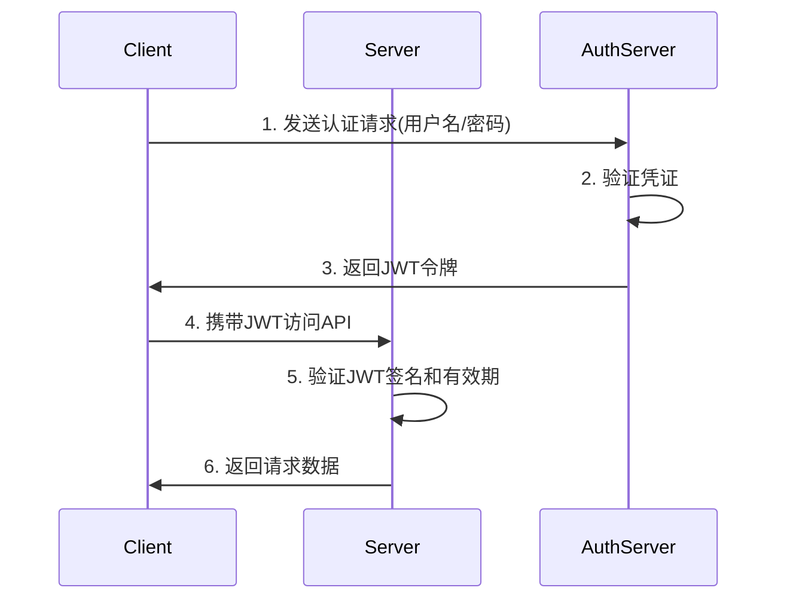
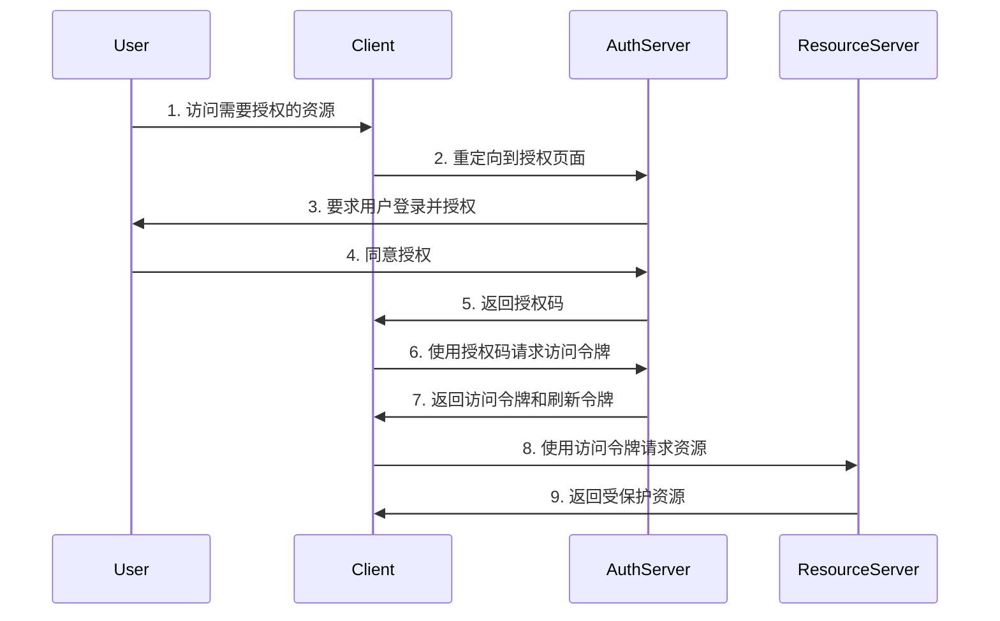

# Spring Security + JWT + OAuth 2.0 安全框架深度解析

## 一、安全框架概述

### 1.1 安全挑战与解决方案
在现代Web应用中，安全是至关重要的环节。主要面临以下挑战：
- **身份验证**：确认用户是谁
- **授权**：决定用户能做什么
- **会话管理**：维护用户登录状态
- **攻击防护**：防止CSRF、XSS等攻击

### 1.2 技术栈组合优势
```plaintext
Spring Security  → 全面的安全基础设施
JWT (JSON Web Token) → 无状态的身份验证令牌
OAuth 2.0 → 行业标准的授权框架
```

## 二、Spring Security 核心架构

### 2.1 核心组件

#### 2.1.1 SecurityContextHolder
```java
// 存储安全上下文的核心类
SecurityContext context = SecurityContextHolder.getContext();
Authentication authentication = context.getAuthentication();
```

#### 2.1.2 Authentication
```java
public interface Authentication extends Principal, Serializable {
    Collection<? extends GrantedAuthority> getAuthorities(); // 权限
    Object getCredentials(); // 凭证（密码）
    Object getDetails(); // 详细信息
    Object getPrincipal(); // 主体（用户信息）
    boolean isAuthenticated(); // 是否认证
}
```

#### 2.1.3 UserDetailsService
```java
@Service
public class CustomUserDetailsService implements UserDetailsService {
    
    @Override
    public UserDetails loadUserByUsername(String username) {
        // 从数据库加载用户信息
        User user = userRepository.findByUsername(username);
        
        return org.springframework.security.core.userdetails.User
            .withUsername(user.getUsername())
            .password(user.getPassword())
            .authorities(user.getRoles())
            .build();
    }
}
```

### 2.2 过滤器链（Filter Chain）
```
请求 → SecurityFilterChain → 响应
    ↓
多个SecurityFilter按顺序处理：
1. WebAsyncManagerIntegrationFilter
2. SecurityContextPersistenceFilter
3. HeaderWriterFilter
4. CsrfFilter
5. LogoutFilter
6. UsernamePasswordAuthenticationFilter
7. DefaultLoginPageGeneratingFilter
8. BasicAuthenticationFilter
9. RequestCacheAwareFilter
10. SecurityContextHolderAwareRequestFilter
11. AnonymousAuthenticationFilter
12. SessionManagementFilter
13. ExceptionTranslationFilter
14. FilterSecurityInterceptor
```

### 2.3 配置示例
```java
@Configuration
@EnableWebSecurity
public class SecurityConfig {
    
    @Bean
    public SecurityFilterChain filterChain(HttpSecurity http) throws Exception {
        http
            .csrf().disable()
            .authorizeHttpRequests(authz -> authz
                .requestMatchers("/api/public/**").permitAll()
                .requestMatchers("/api/admin/**").hasRole("ADMIN")
                .anyRequest().authenticated()
            )
            .formLogin()
                .loginPage("/login")
                .permitAll()
            .and()
            .logout()
                .logoutSuccessUrl("/")
                .permitAll();
        
        return http.build();
    }
}
```

## 三、JWT（JSON Web Token）深度解析

### 3.1 JWT 结构
```
Header.Payload.Signature
```

#### 3.1.1 Header
```json
{
  "alg": "HS256",
  "typ": "JWT"
}
```

#### 3.1.2 Payload
```json
{
  "sub": "1234567890",
  "name": "John Doe",
  "iat": 1516239022,
  "exp": 1516242622,
  "roles": ["USER", "ADMIN"]
}
```

#### 3.1.3 Signature
```java
HMACSHA256(
  base64UrlEncode(header) + "." + 
  base64UrlEncode(payload),
  secret)
```

### 3.2 JWT 工作流程


### 3.3 JWT 实现示例

#### 3.3.1 JWT工具类
```java
@Component
public class JwtTokenProvider {
    
    @Value("${jwt.secret}")
    private String jwtSecret;
    
    @Value("${jwt.expiration}")
    private long jwtExpiration;
    
    // 生成Token
    public String generateToken(Authentication authentication) {
        Date now = new Date();
        Date expiryDate = new Date(now.getTime() + jwtExpiration);
        
        UserDetails userDetails = (UserDetails) authentication.getPrincipal();
        
        return Jwts.builder()
            .setSubject(userDetails.getUsername())
            .setIssuedAt(now)
            .setExpiration(expiryDate)
            .claim("roles", userDetails.getAuthorities().stream()
                .map(GrantedAuthority::getAuthority)
                .collect(Collectors.toList()))
            .signWith(SignatureAlgorithm.HS512, jwtSecret)
            .compact();
    }
    
    // 验证Token
    public boolean validateToken(String token) {
        try {
            Jwts.parser().setSigningKey(jwtSecret).parseClaimsJws(token);
            return true;
        } catch (Exception ex) {
            // 处理各种异常
        }
        return false;
    }
    
    // 从Token获取用户名
    public String getUsernameFromToken(String token) {
        Claims claims = Jwts.parser()
            .setSigningKey(jwtSecret)
            .parseClaimsJws(token)
            .getBody();
        return claims.getSubject();
    }
}
```

#### 3.3.2 JWT认证过滤器
```java
public class JwtAuthenticationFilter extends OncePerRequestFilter {
    
    @Autowired
    private JwtTokenProvider tokenProvider;
    
    @Autowired
    private CustomUserDetailsService userDetailsService;
    
    @Override
    protected void doFilterInternal(HttpServletRequest request,
                                   HttpServletResponse response,
                                   FilterChain filterChain)
            throws ServletException, IOException {
        
        try {
            String jwt = getJwtFromRequest(request);
            
            if (StringUtils.hasText(jwt) && tokenProvider.validateToken(jwt)) {
                String username = tokenProvider.getUsernameFromToken(jwt);
                
                UserDetails userDetails = userDetailsService.loadUserByUsername(username);
                UsernamePasswordAuthenticationToken authentication = 
                    new UsernamePasswordAuthenticationToken(
                        userDetails, null, userDetails.getAuthorities());
                authentication.setDetails(new WebAuthenticationDetailsSource().buildDetails(request));
                
                SecurityContextHolder.getContext().setAuthentication(authentication);
            }
        } catch (Exception ex) {
            logger.error("无法设置用户认证", ex);
        }
        
        filterChain.doFilter(request, response);
    }
    
    private String getJwtFromRequest(HttpServletRequest request) {
        String bearerToken = request.getHeader("Authorization");
        if (StringUtils.hasText(bearerToken) && bearerToken.startsWith("Bearer ")) {
            return bearerToken.substring(7);
        }
        return null;
    }
}
```

## 四、OAuth 2.0 授权框架

### 4.1 OAuth 2.0 核心概念

#### 4.1.1 四种授权模式
1. **授权码模式（Authorization Code）** - 最安全，适用于Web应用
2. **简化模式（Implicit）** - 适用于SPA
3. **密码模式（Resource Owner Password Credentials）** - 信任的应用
4. **客户端凭证模式（Client Credentials）** - 服务器到服务器

#### 4.1.2 角色定义
- **Resource Owner**：资源所有者（用户）
- **Client**：第三方应用
- **Authorization Server**：授权服务器
- **Resource Server**：资源服务器

### 4.2 OAuth 2.0 工作流程（授权码模式）


### 4.3 Spring Security OAuth2 实现

#### 4.3.1 授权服务器配置
```java
@Configuration
@EnableAuthorizationServer
public class AuthorizationServerConfig extends AuthorizationServerConfigurerAdapter {
    
    @Autowired
    private AuthenticationManager authenticationManager;
    
    @Autowired
    private DataSource dataSource;
    
    @Autowired
    private PasswordEncoder passwordEncoder;
    
    @Override
    public void configure(ClientDetailsServiceConfigurer clients) throws Exception {
        clients.jdbc(dataSource);
    }
    
    @Override
    public void configure(AuthorizationServerEndpointsConfigurer endpoints) {
        endpoints
            .authenticationManager(authenticationManager)
            .tokenStore(tokenStore())
            .accessTokenConverter(accessTokenConverter());
    }
    
    @Bean
    public TokenStore tokenStore() {
        return new JwtTokenStore(accessTokenConverter());
    }
    
    @Bean
    public JwtAccessTokenConverter accessTokenConverter() {
        JwtAccessTokenConverter converter = new JwtAccessTokenConverter();
        converter.setSigningKey("mySecretKey");
        return converter;
    }
}
```

#### 4.3.2 资源服务器配置
```java
@Configuration
@EnableResourceServer
public class ResourceServerConfig extends ResourceServerConfigurerAdapter {
    
    @Override
    public void configure(HttpSecurity http) throws Exception {
        http
            .authorizeRequests()
            .antMatchers("/api/public/**").permitAll()
            .antMatchers("/api/**").authenticated()
            .anyRequest().authenticated();
    }
    
    @Override
    public void configure(ResourceServerSecurityConfigurer resources) {
        resources.resourceId("api");
    }
}
```

## 五、三者的整合架构

### 5.1 整合架构图
```
┌─────────────────────────────────────────────────────────────┐
│                   客户端 (Client Applications)                │
├─────────────────────────────────────────────────────────────┤
│  Web App │ Mobile App │ SPA │ Desktop App │ IoT Device     │
└─────────────────────────────────────────────────────────────┘
                            │
                            ▼
┌─────────────────────────────────────────────────────────────┐
│                 Spring Security Filter Chain                │
│  ┌─────────────┬─────────────┬──────────────────────────┐  │
│  │JWT Filter   │OAuth2 Filter│ Other Security Filters   │  │
│  └─────────────┴─────────────┴──────────────────────────┘  │
└─────────────────────────────────────────────────────────────┘
                            │
                            ▼
┌─────────────────────────────────────────────────────────────┐
│                 业务应用 (Business Logic)                    │
│  ┌──────────────────────────────────────────────────────┐  │
│  │  Controllers │ Services │ Repositories │ Components  │  │
│  └──────────────────────────────────────────────────────┘  │
└─────────────────────────────────────────────────────────────┘
```

### 5.2 完整整合配置
```java
@Configuration
@EnableWebSecurity
public class SecurityConfig {
    
    @Autowired
    private JwtAuthenticationFilter jwtAuthenticationFilter;
    
    @Autowired
    private CustomOAuth2UserService oAuth2UserService;
    
    @Autowired
    private OAuth2AuthenticationSuccessHandler oAuth2SuccessHandler;
    
    @Bean
    public SecurityFilterChain filterChain(HttpSecurity http) throws Exception {
        http
            .cors()
                .and()
            .csrf()
                .disable()
            .sessionManagement()
                .sessionCreationPolicy(SessionCreationPolicy.STATELESS)
                .and()
            .authorizeHttpRequests()
                .requestMatchers("/auth/**", "/oauth2/**").permitAll()
                .requestMatchers("/api/admin/**").hasRole("ADMIN")
                .anyRequest().authenticated()
                .and()
            .oauth2Login()
                .userInfoEndpoint()
                    .userService(oAuth2UserService)
                    .and()
                .successHandler(oAuth2SuccessHandler)
                .and()
            .addFilterBefore(jwtAuthenticationFilter, 
                UsernamePasswordAuthenticationFilter.class);
        
        return http.build();
    }
    
    @Bean
    public PasswordEncoder passwordEncoder() {
        return new BCryptPasswordEncoder();
    }
}
```

### 5.3 JWT + OAuth2 整合实现

#### 5.3.1 OAuth2 成功处理器（返回JWT）
```java
@Component
public class OAuth2AuthenticationSuccessHandler extends SimpleUrlAuthenticationSuccessHandler {
    
    @Autowired
    private JwtTokenProvider tokenProvider;
    
    @Override
    public void onAuthenticationSuccess(HttpServletRequest request,
                                       HttpServletResponse response,
                                       Authentication authentication)
            throws IOException, ServletException {
        
        // 生成JWT令牌
        String jwt = tokenProvider.generateToken(authentication);
        
        // 构建响应
        Map<String, Object> body = new HashMap<>();
        body.put("token", jwt);
        body.put("user", authentication.getPrincipal());
        
        response.setContentType(MediaType.APPLICATION_JSON_VALUE);
        response.getWriter().write(new ObjectMapper().writeValueAsString(body));
        response.getWriter().flush();
    }
}
```

#### 5.3.2 OAuth2用户服务
```java
@Service
public class CustomOAuth2UserService extends DefaultOAuth2UserService {
    
    @Autowired
    private UserRepository userRepository;
    
    @Autowired
    private PasswordEncoder passwordEncoder;
    
    @Override
    public OAuth2User loadUser(OAuth2UserRequest userRequest) throws OAuth2AuthenticationException {
        OAuth2User oAuth2User = super.loadUser(userRequest);
        
        // 处理第三方登录用户信息
        String email = oAuth2User.getAttribute("email");
        String name = oAuth2User.getAttribute("name");
        
        // 检查用户是否存在
        User user = userRepository.findByEmail(email);
        if (user == null) {
            // 创建新用户
            user = new User();
            user.setEmail(email);
            user.setUsername(email);
            user.setName(name);
            user.setPassword(passwordEncoder.encode(UUID.randomUUID().toString()));
            user.setProvider(userRequest.getClientRegistration().getRegistrationId());
            user.setProviderId(oAuth2User.getAttribute("sub"));
            userRepository.save(user);
        }
        
        return new CustomOAuth2User(oAuth2User, user);
    }
}
```

## 六、高级特性与最佳实践

### 6.1 令牌刷新机制
```java
@RestController
@RequestMapping("/api/auth")
public class AuthController {
    
    @Autowired
    private JwtTokenProvider tokenProvider;
    
    @PostMapping("/refresh")
    public ResponseEntity<?> refreshToken(@RequestBody RefreshTokenRequest request) {
        try {
            // 验证刷新令牌
            if (!tokenProvider.validateRefreshToken(request.getRefreshToken())) {
                return ResponseEntity.status(HttpStatus.UNAUTHORIZED).build();
            }
            
            // 生成新的访问令牌
            String username = tokenProvider.getUsernameFromRefreshToken(request.getRefreshToken());
            Authentication authentication = // 获取认证信息
            
            String newAccessToken = tokenProvider.generateToken(authentication);
            String newRefreshToken = tokenProvider.generateRefreshToken(authentication);
            
            return ResponseEntity.ok(new TokenResponse(newAccessToken, newRefreshToken));
        } catch (Exception e) {
            return ResponseEntity.status(HttpStatus.UNAUTHORIZED).build();
        }
    }
}
```

### 6.2 权限控制注解
```java
@RestController
@RequestMapping("/api/products")
public class ProductController {
    
    @PreAuthorize("hasRole('ADMIN') or hasPermission(#id, 'Product', 'READ')")
    @GetMapping("/{id}")
    public ResponseEntity<Product> getProduct(@PathVariable Long id) {
        // ...
    }
    
    @PreAuthorize("@securityService.isProductOwner(#productId)")
    @PutMapping("/{productId}")
    public ResponseEntity<Product> updateProduct(@PathVariable Long productId) {
        // ...
    }
}
```

### 6.3 安全事件监听
```java
@Component
public class SecurityEventListener {
    
    @EventListener
    public void handleAuthenticationSuccess(AuthenticationSuccessEvent event) {
        // 记录登录成功
        logger.info("用户 {} 登录成功", event.getAuthentication().getName());
    }
    
    @EventListener
    public void handleAuthenticationFailure(AuthenticationFailureBadCredentialsEvent event) {
        // 处理登录失败
        logger.warn("登录失败: {}", event.getException().getMessage());
    }
}
```

### 6.4 分布式会话管理（Redis）
```java
@Configuration
@EnableRedisHttpSession
public class SessionConfig {
    
    @Bean
    public LettuceConnectionFactory connectionFactory() {
        return new LettuceConnectionFactory();
    }
    
    @Bean
    public RedisOperationsSessionRepository sessionRepository() {
        RedisTemplate<Object, Object> redisTemplate = new RedisTemplate<>();
        redisTemplate.setConnectionFactory(connectionFactory());
        
        return new RedisOperationsSessionRepository(redisTemplate);
    }
}
```

## 七、安全测试与监控

### 7.1 安全测试示例
```java
@SpringBootTest
@AutoConfigureMockMvc
class SecurityTests {
    
    @Autowired
    private MockMvc mockMvc;
    
    @Test
    @WithMockUser(username = "admin", roles = {"ADMIN"})
    void testAdminEndpoint() throws Exception {
        mockMvc.perform(get("/api/admin/dashboard"))
               .andExpect(status().isOk());
    }
    
    @Test
    void testUnauthenticatedAccess() throws Exception {
        mockMvc.perform(get("/api/admin/dashboard"))
               .andExpect(status().isForbidden());
    }
}
```

### 7.2 安全监控指标
```yaml
management:
  endpoints:
    web:
      exposure:
        include: health,metrics,auditevents
  metrics:
    export:
      prometheus:
        enabled: true

security:
  endpoints:
    enabled: false  # 生产环境应禁用
```

## 八、总结与部署建议

### 8.1 技术选型建议
| 场景 | 推荐方案 | 说明 |
|------|----------|------|
| 单体应用 | Spring Security + JWT | 简单高效，无状态 |
| 微服务架构 | Spring Security + OAuth2 + JWT | 统一认证授权 |
| 第三方集成 | OAuth2.0 | 标准协议，兼容性好 |
| 高并发系统 | JWT + Redis | 减少数据库压力 |

### 8.2 安全配置清单
1. ✅ 使用HTTPS传输
2. ✅ 设置合理的令牌过期时间
3. ✅ 实现令牌刷新机制
4. ✅ 启用CORS配置
5. ✅ 配置CSRF保护
6. ✅ 实现速率限制
7. ✅ 记录安全日志
8. ✅ 定期更新密钥
9. ✅ 进行安全扫描

### 8.3 性能优化建议
```properties
# JWT配置优化
jwt.expiration=3600000  # 1小时
jwt.refresh-expiration=2592000000  # 30天

# 缓存配置
spring.cache.type=redis
spring.cache.redis.time-to-live=600000  # 10分钟

# 连接池配置
spring.datasource.hikari.maximum-pool-size=20
spring.redis.lettuce.pool.max-active=20
```