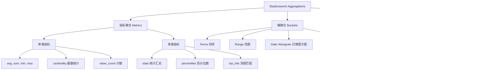

# 文档数据库与倒排索引

## 一、MongoDB文档型数据库核心

### 1.1 核心概念（与关系型数据库对比）
MongoDB是一种基于**BSON（二进制JSON）**的文档型NoSQL数据库，其核心设计理念是“无固定Schema、易扩展、面向文档”，特别适合存储非结构化或半结构化数据。

| MongoDB概念 | 关系型数据库（MySQL） | 核心说明 |
|------------|-------------------|----------|
| 数据库（DB） | 数据库 | 逻辑隔离的数据集，如`ecommerce`存储电商数据 |
| 集合（Collection） | 表 | 存储文档的容器，无需预定义字段结构 |
| 文档（Document） | 行 | 基本数据单元，BSON格式，支持嵌套和数组 |
| 字段（Field） | 列 | 文档属性，可动态增删 |
| _id字段 | 主键 | 默认唯一标识，可自定义或自动生成ObjectId |

### 1.2 核心特性

#### 🔸 Schema灵活性
- 集合无需预定义字段类型和数量
- 不同文档可拥有完全不同的字段结构
- 支持运行时动态添加或删除字段

#### 🔸 丰富的数据类型
- 基本类型：String、Number、Boolean、Null
- 复杂类型：Array、Object（嵌套文档）
- 特殊类型：ObjectId、Date、Timestamp、Binary Data
- 地理空间：GeoJSON Point、LineString、Polygon
- 其他：Regular Expression、JavaScript Code

#### 🔸 高可用架构
- **副本集（Replica Set）**：1主N从架构，自动故障转移
  - 主节点处理所有写操作
  - 从节点异步复制数据，可处理读请求
  - 自动选举机制保证高可用性
  
- **分片集群（Sharding）**：水平扩展解决方案
  - 数据按分片键分布到多个节点
  - 支持范围分片和哈希分片策略
  - 查询路由器（mongos）自动路由请求

### 1.3 常用CRUD操作

```javascript
// ========== 插入操作 ==========
// 单条插入
db.users.insertOne({
    name: "李四", 
    age: 30, 
    address: {
        province: "北京", 
        city: "朝阳"
    }
});

// 批量插入
db.users.insertMany([
    {name: "王五", age: 28},
    {name: "赵六", age: 35}
]);

// ========== 查询操作 ==========
// 条件查询
db.users.find({age: {$gt: 28}}); // 年龄>28

// 投影查询（只返回指定字段）
db.users.find({}, {name: 1, age: 1, _id: 0});

// 嵌套文档查询
db.users.find({"address.province": "北京"});

// 数组查询
db.users.find({hobbies: "篮球"}); // 数组包含"篮球"
db.users.find({hobbies: {$all: ["篮球", "游泳"]}}); // 包含所有元素
db.users.find({hobbies: {$size: 3}}); // 数组长度为3

// 排序和分页
db.users.find()
    .sort({age: -1})    // 降序排序
    .limit(10)          // 限制10条
    .skip(20);          // 跳过前20条

// ========== 更新操作 ==========
// 单条更新
db.users.updateOne(
    {name: "李四"}, 
    {$set: {age: 31}}
);

// 批量更新
db.users.updateMany(
    {age: {$lt: 30}}, 
    {$inc: {age: 1}}    // 年龄加1
);

// 数组操作
db.users.updateOne(
    {name: "王五"},
    {$push: {hobbies: "阅读"}}  // 添加数组元素
);

// ========== 删除操作 ==========
db.users.deleteOne({name: "赵六"});      // 单条删除
db.users.deleteMany({age: {$gt: 35}});   // 批量删除
```

### 1.4 索引最佳实践

#### 📊 索引类型
1. **单字段索引**：最常用，适合高频查询字段
   ```javascript
   db.users.createIndex({user_id: 1});  // 升序索引
   ```

2. **复合索引**：多字段组合查询
   ```javascript
   // 等值字段在前，范围字段在后
   db.users.createIndex({province: 1, age: -1});
   ```

3. **多键索引**：数组字段索引
   ```javascript
   db.users.createIndex({hobbies: 1});
   ```

4. **文本索引**：全文搜索（功能有限）
   ```javascript
   db.articles.createIndex({content: "text"});
   ```

5. **地理空间索引**：位置查询
   ```javascript
   db.places.createIndex({location: "2dsphere"});
   ```

#### ⚠️ 索引注意事项
- **索引顺序原则**：等值查询字段在前，范围查询字段在后
- **索引覆盖查询**：尽量让查询只使用索引，避免回表
- **避免过多索引**：每个索引都会增加写操作开销
- **监控索引使用**：定期使用`$indexStats`分析索引效率
- **索引大小限制**：单个索引条目不能超过1024字节

#### 🔍 查询性能分析
```javascript
// 分析查询执行计划
db.users.find({age: 30})
    .explain("executionStats");

// 查看索引使用情况
db.users.aggregate([{$indexStats: {}}]);
```

---

## 二、Elasticsearch倒排索引核心技术

### 2.1 索引机制对比

#### 正排索引 vs 倒排索引

| 特性 | 正排索引（Forward Index） | 倒排索引（Inverted Index） |
|------|-------------------------|--------------------------|
| 结构 | 文档ID → 文档内容关键词 | 关键词 → 包含该词的文档ID列表 |
| 查询方式 | 已知文档ID查内容 | 已知关键词查文档 |
| 优点 | 简单直观，更新方便 | 全文检索极快，支持复杂查询 |
| 缺点 | 全文检索性能差 | 写入开销大，存储空间较大 |

#### 📝 示例说明
假设有以下文档：
- 文档1：`"Elasticsearch is a search engine"`
- 文档2：`"MongoDB is a document database"`

**正排索引结构：**
```
文档1 → [Elasticsearch, search, engine]
文档2 → [MongoDB, document, database]
```

**倒排索引结构：**
```
Elasticsearch → [文档1]
search → [文档1]
engine → [文档1]
MongoDB → [文档2]
document → [文档2]
database → [文档2]
```

### 2.2 倒排索引核心组成

#### 🔤 词典（Term Dictionary）
- 存储所有去重后的关键词
- 按字母顺序排序，支持二分查找
- 内存中存储前缀索引（Term Index），加速定位

#### 📋 倒排列表（Posting List）
每个关键词对应一个倒排列表，包含：
1. **文档ID列表**：包含该词的所有文档ID
2. **词频（TF）**：该词在文档中出现的次数
3. **位置（Position）**：该词在文档中的位置信息
4. **偏移量（Offset）**：该词在文档中的字符起止位置
5. **其他元数据**：如文档权重、字段信息等

### 2.3 倒排索引优化机制

#### 🔧 索引压缩技术
1. **增量编码（Delta Encoding）**
   ```
   原始ID: [100, 101, 105, 110]
   增量编码: [100, 1, 4, 5]
   ```

2. **变长字节编码（Variable Byte）**
   - 小数值用较少字节存储
   - 大数值用较多字节存储

3. **帧对位压缩（Frame Of Reference）**
   - 将文档ID分组压缩
   - 每个组内使用相同位宽存储

#### 🚀 查询优化策略
1. **跳表（Skip List）**：在倒排列表中建立跳表，加速AND/OR查询
2. **布隆过滤器（Bloom Filter）**：快速判断关键词是否存在
3. **缓存机制**：
   - Filter Cache：缓存过滤查询结果
   - Field Data Cache：缓存字段数据用于聚合
   - Query Cache：缓存查询结果

### 2.4 索引更新机制
ES采用**写时复制（Copy-on-Write）**策略处理索引更新：

```
更新流程：
1. 标记旧文档为删除（.del文件）
2. 创建新的倒排索引段（Segment）
3. 查询时合并新旧段结果
4. 定期段合并（Segment Merge）
   - 合并多个小段为一个大段
   - 物理删除标记删除的文档
   - 优化索引结构
```

### 2.5 核心应用场景

#### 🔍 全文检索
```json
GET /articles/_search
{
  "query": {
    "match": {
      "content": "全文检索技术"
    }
  },
  "highlight": {
    "fields": {
      "content": {}
    }
  }
}
```

#### 📊 相关性排序
- **TF-IDF算法**：词频 × 逆文档频率
- **BM25算法**：改进的TF-IDF，ES默认算法
- **向量空间模型**：文档相似度计算

#### 🎯 语义搜索（ES 8.0+）
```json
{
  "query": {
    "neural": {
      "embedding": {
        "query_text": "人工智能应用",
        "model_id": "my-text-embedding-model",
        "k": 100
      }
    }
  }
}
```

---

## 三、聚合查询深度对比

### 3.1 MongoDB聚合管道

#### 🎯 核心聚合阶段

| 阶段 | 作用 | 示例 |
|------|------|------|
| `$match` | 文档过滤 | `{$match: {age: {$gt: 18}}}` |
| `$group` | 分组统计 | `{$group: {_id: "$city", count: {$sum: 1}}}` |
| `$sort` | 结果排序 | `{$sort: {count: -1}}` |
| `$project` | 字段投影 | `{$project: {city: "$_id", total: 1, _id: 0}}` |
| `$lookup` | 集合关联 | 类似SQL JOIN |
| `$unwind` | 数组展开 | `{$unwind: "$hobbies"}` |
| `$facet` | 多面聚合 | 同时进行多个聚合分析 |

#### 📊 复杂聚合示例
```javascript
// 统计各城市不同年龄段用户分布
db.users.aggregate([
  {
    $match: {
      register_date: {
        $gte: ISODate("2024-01-01"),
        $lt: ISODate("2025-01-01")
      }
    }
  },
  {
    $bucket: {
      groupBy: "$age",
      boundaries: [0, 18, 30, 50, 100],
      default: "other",
      output: {
        count: {$sum: 1},
        avg_score: {$avg: "$credit_score"},
        cities: {$push: "$city"}
      }
    }
  },
  {
    $project: {
      age_group: "$_id",
      user_count: "$count",
      average_credit: {$round: ["$avg_score", 2]},
      unique_cities: {$size: {$setUnion: ["$cities", []]}},
      _id: 0
    }
  },
  {$sort: {user_count: -1}},
  {$limit: 10}
]);
```

### 3.2 Elasticsearch聚合框架

#### 🎯 聚合类型体系



#### 📈 完整聚合示例
```json
GET /sales/_search
{
  "size": 0,
  "query": {
    "range": {
      "sale_date": {
        "gte": "2024-01-01",
        "lte": "2024-12-31"
      }
    }
  },
  "aggs": {
    "monthly_sales": {
      "date_histogram": {
        "field": "sale_date",
        "calendar_interval": "month",
        "format": "yyyy-MM",
        "order": {"_key": "asc"}
      },
      "aggs": {
        "by_category": {
          "terms": {
            "field": "category.keyword",
            "size": 5
          },
          "aggs": {
            "total_amount": {
              "sum": {"field": "amount"}
            },
            "avg_price": {
              "avg": {"field": "unit_price"}
            },
            "top_products": {
              "top_hits": {
                "size": 3,
                "_source": ["product_name", "brand"],
                "sort": [{"amount": {"order": "desc"}}]
              }
            }
          }
        },
        "month_total": {
          "sum_bucket": {
            "buckets_path": "by_category>total_amount"
          }
        },
        "monthly_growth": {
          "derivative": {
            "buckets_path": "month_total"
          }
        }
      }
    },
    "overall_stats": {
      "stats": {"field": "amount"}
    }
  }
}
```

### 3.3 MongoDB vs Elasticsearch聚合对比

| 特性维度 | MongoDB | Elasticsearch |
|---------|---------|---------------|
| **设计理念** | 文档处理管道 | 检索结果分析 |
| **性能特点** | 单机聚合快，集群需优化 | 分布式并行计算，大数据量优 |
| **时间聚合** | 支持但语法复杂 | `date_histogram`原生支持 |
| **全文检索+聚合** | 有限支持（文本索引） | 原生一体化支持 |
| **关联查询** | `$lookup`支持JOIN | nested/parent-child有限支持 |
| **实时性** | 实时聚合 | 近实时（默认1秒延迟） |
| **内存管理** | 100MB内存限制（可调整） | 使用JVM堆内存，需精细调优 |
| **学习曲线** | 相对简单 | 概念复杂，但功能强大 |

### 3.4 场景化选择指南

#### 🛒 电商业务场景
```yaml
# 商品搜索+筛选+排序 → Elasticsearch
- 全文检索商品标题/描述
- 多维度筛选（品牌、价格、分类）
- 相关性排序 + 销量排序
- 搜索词建议（completion suggester）

# 订单分析统计 → MongoDB
- 用户订单历史查询
- 复杂的分组统计（按地区、时间、商品）
- 关联用户信息分析
- 实时库存管理
```

#### 📊 日志分析场景
```yaml
# 日志检索分析 → Elasticsearch
- 关键词快速检索
- 错误日志聚类分析
- 时间序列趋势分析
- 实时监控仪表板

# 日志归档查询 → MongoDB
- 结构化日志存储
- 长时间范围统计
- 复杂关联分析
- 审计日志管理
```

---

## 四、最佳实践与调优指南

### 4.1 MongoDB性能优化

#### 🔧 查询优化
1. **使用投影减少返回数据**
   ```javascript
   // 不好
   db.users.find({age: {$gt: 18}});
   
   // 好：只返回需要的字段
   db.users.find({age: {$gt: 18}}, {name: 1, email: 1, _id: 0});
   ```

2. **合理使用索引提示**
   ```javascript
   db.users.find({city: "北京", age: {$gt: 30}})
       .hint({city: 1, age: 1});
   ```

3. **避免全集合扫描**
   ```javascript
   // 监控慢查询
   db.setProfilingLevel(1, {slowms: 100});
   db.system.profile.find().sort({ts: -1}).limit(10);
   ```

#### 🗄️ 存储优化
1. **文档设计原则**
   ```javascript
   // 反范式化设计：将关联数据嵌入文档
   {
     _id: "order_001",
     user: {
       id: "user_123",
       name: "张三",
       email: "zhangsan@example.com"
     },
     items: [
       {product_id: "p1", name: "商品A", price: 100},
       {product_id: "p2", name: "商品B", price: 200}
     ]
   }
   ```

2. **适时使用引用**
   ```javascript
   // 当关联数据频繁更新或过大时使用引用
   {
     _id: "order_001",
     user_id: "user_123",  // 引用用户集合
     items: ["p1", "p2"]   // 引用商品集合
   }
   ```

### 4.2 Elasticsearch性能调优

#### ⚙️ 索引设计优化
1. **Mapping设计原则**
   ```json
   {
     "mappings": {
       "dynamic": "strict",  // 严格控制字段类型
       "properties": {
         "title": {
           "type": "text",
           "analyzer": "ik_max_word",  // 中文分词
           "fields": {
             "keyword": {
               "type": "keyword",      // 用于聚合排序
               "ignore_above": 256
             }
           }
         },
         "price": {
           "type": "scaled_float",    // 节省存储空间
           "scaling_factor": 100
         }
       }
     }
   }
   ```

2. **分片策略配置**
   ```yaml
   # 分片数 = 数据总量 / 单个分片推荐大小(30-50GB)
   # 副本数 = 根据读吞吐量和可用性要求设置(通常1-2)
   
   PUT /my_index
   {
     "settings": {
       "number_of_shards": 5,      # 主分片数
       "number_of_replicas": 1,    # 副本数
       "refresh_interval": "30s"   # 降低刷新频率提升写入性能
     }
   }
   ```

#### 🔍 查询性能优化
1. **使用filter上下文**
   ```json
   {
     "query": {
       "bool": {
         "filter": [
           {"range": {"price": {"gte": 100, "lte": 1000}}},
           {"term": {"category": "electronics"}}
         ],
         "must": [
           {"match": {"description": "wireless bluetooth"}}
         ]
       }
     }
   }
   ```

2. **分页优化**
   ```json
   // 深度分页使用search_after
   {
     "size": 100,
     "sort": [
       {"_id": "asc"}
     ],
     "search_after": ["last_id_value"]
   }
   ```

### 4.3 混合架构实践

#### 🔄 数据同步方案
1. **变更数据捕获（CDC）**
   ```
   MongoDB → MongoDB Connector → Kafka → Elasticsearch
   
   优点：
   - 实时数据同步
   - 解耦系统依赖
   - 支持数据转换
   ```

2. **双写策略**
   ```javascript
   // 应用层同时写入两个数据库
   async function createProduct(product) {
     // 写入MongoDB（主存储）
     const mongoResult = await mongoDb.products.insertOne(product);
     
     // 写入Elasticsearch（搜索索引）
     const esResult = await esClient.index({
       index: 'products',
       id: product.id,
       document: product
     });
     
     return {mongo: mongoResult, es: esResult};
   }
   ```

#### 📋 数据一致性保障
```javascript
class DualWriteManager {
  constructor(mongoClient, esClient) {
    this.mongoClient = mongoClient;
    this.esClient = esClient;
    this.compensationActions = new Map();
  }
  
  async dualWrite(operation, data) {
    const transactionId = uuidv4();
    
    try {
      // 阶段1：预写入
      await this.prepareWrite(transactionId, operation, data);
      
      // 阶段2：执行MongoDB操作
      const mongoResult = await this.executeMongoOperation(operation, data);
      
      // 阶段3：执行ES操作
      const esResult = await this.executeESOperation(operation, data);
      
      // 阶段4：确认提交
      await this.commitTransaction(transactionId);
      
      return {success: true, mongo: mongoResult, es: esResult};
      
    } catch (error) {
      // 补偿操作
      await this.compensate(transactionId);
      throw error;
    }
  }
}
```

---

## 五、监控与运维

### 5.1 MongoDB监控指标

#### 📊 关键性能指标
```bash
# 使用mongostat实时监控
mongostat --host localhost:27017 --rowcount 10 1

# 使用db.serverStatus()获取状态
db.serverStatus().metrics

# 重要指标：
# - 操作计数器（opcounters）
# - 连接数（connections）
# - 内存使用（mem）
# - 网络流量（network）
# - 锁等待时间（locks）
```

#### 🔔 告警配置
```yaml
# Prometheus监控配置示例
scrape_configs:
  - job_name: 'mongodb'
    static_configs:
      - targets: ['mongodb:9216']
    
# 关键告警规则：
# - 连接数超过80%
# - 复制延迟超过10秒
# - CPU使用率持续高于70%
# - 磁盘使用率超过85%
```

### 5.2 Elasticsearch监控运维

#### 📈 集群健康检查
```json
GET /_cluster/health
{
  "cluster_name": "my-cluster",
  "status": "green",  # green, yellow, red
  "timed_out": false,
  "number_of_nodes": 3,
  "number_of_data_nodes": 2,
  "active_primary_shards": 10,
  "active_shards": 20,
  "relocating_shards": 0,
  "initializing_shards": 0,
  "unassigned_shards": 0,
  "delayed_unassigned_shards": 0,
  "number_of_pending_tasks": 0,
  "number_of_in_flight_fetch": 0,
  "task_max_waiting_in_queue_millis": 0,
  "active_shards_percent_as_number": 100.0
}
```

#### 🛠️ 运维命令
```bash
# 查看索引状态
GET /_cat/indices?v

# 查看分片分配
GET /_cat/shards?v

# 清理缓存（谨慎使用）
POST /_cache/clear

# 强制段合并（优化只读索引）
POST /my_index/_forcemerge?max_num_segments=1
```

---

## 六、总结与选型建议

### 6.1 技术选型矩阵

| 场景特征 | 推荐方案 | 理由 |
|---------|---------|------|
| **Schema频繁变化** | MongoDB | 无模式设计适应变化 |
| **复杂事务需求** | MongoDB（4.0+支持事务） | 文档级事务支持 |
| **全文检索为主** | Elasticsearch | 倒排索引专业优化 |
| **实时数据分析** | Elasticsearch | 近实时搜索分析 |
| **地理位置应用** | 两者均可 | MongoDB地理索引更成熟 |
| **日志处理分析** | Elasticsearch | ELK栈生态完善 |
| **内容管理系统** | MongoDB | 嵌套文档适合内容模型 |
| **商品搜索系统** | Elasticsearch | 多维度筛选排序强大 |

### 6.2 架构演进建议

#### 🏗️ 初期阶段（快速验证）
```yaml
架构: MongoDB单实例
理由:
- 开发速度快
- 降低运维复杂度
- 适应业务快速变化
```

#### 🚀 成长阶段（业务扩展）
```yaml
架构: MongoDB副本集 + Elasticsearch集群
理由:
- 读写分离提升性能
- 搜索专业化
- 高可用保障
```

#### 🌟 成熟阶段（大规模应用）
```yaml
架构: 
  - MongoDB分片集群（处理海量数据）
  - Elasticsearch多集群（隔离不同业务）
  - 数据同步管道（保证一致性）
  - 混合查询引擎（统一查询接口）
```

### 6.3 未来趋势

1. **融合趋势**：MongoDB Atlas提供全文搜索功能，ES增加文档存储能力
2. **AI集成**：向量搜索、语义理解、智能推荐
3. **云原生**：Serverless数据库服务，自动扩缩容
4. **多模数据库**：同时支持文档、图、时序等多种数据模型

---

## 📚 学习资源

### 官方文档
- [MongoDB官方文档](https://docs.mongodb.com/)
- [Elasticsearch官方指南](https://www.elastic.co/guide/index.html)


